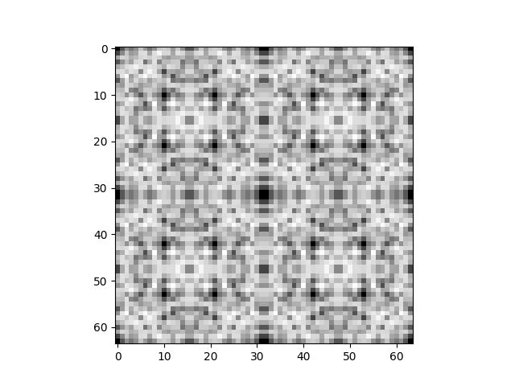

# Visualizing Kolmogorov Complexity

This repository is an attempt to visualize the Kolmogorov Complexity (KC) of short
bit strings. The following figure estimates the KC of the first 4,096 integers:

Each of the 4,096 pixels represents a bit string. Its brightness is the
estimated KC. The pixels are _not_ arranged 0, 1, ..., 63 in the first row,
64, ..., 127 in the second row, etc. Instead, they are arranged in such a way
that each pixel's neighbor has exactly one bit flipped.

# Implementation details

The KC is estimated using the R library from
[complexitycalculator.com](http://www.complexitycalculator.com/DownloadDataAndTools.html).

# Running the code

You need Python >= 3.7 and R. Create a virtual environment:

    python3 -m venv venv

Activate it:

    # Linux / Mac:
    source venv/bin/activate
    # Windows:
    call venv\scripts\activate.bat

Install the dependencies:

    pip install -Ur requirements.txt

Run the code:

    python main.py